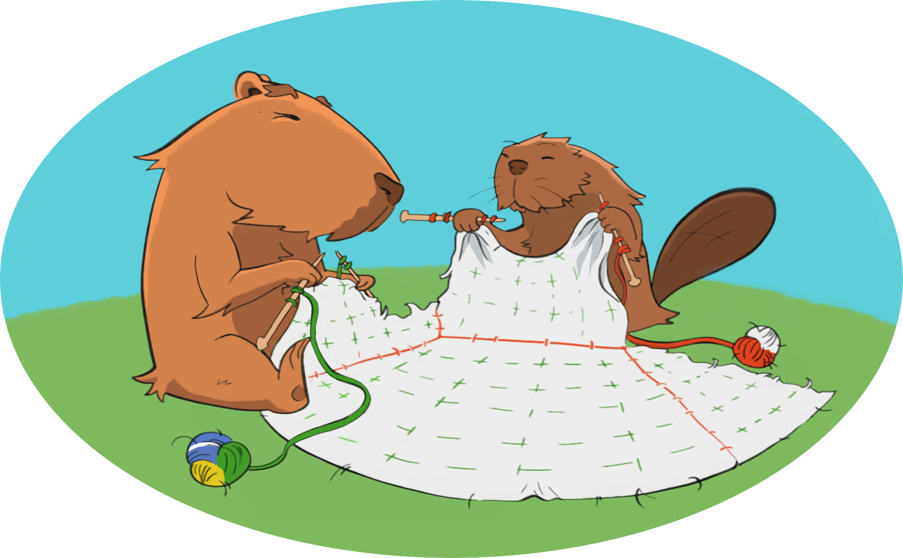

  

**CapyrX** is a GPU-accelerated multipatch infrastructure, written in C++. It is built upon the [CarpetX](https://github.com/eschnett/CarpetX) AMR driver, which is intended for the [Einstein Toolkit](https://einsteintoolkit.org/).

**CarpetX** is based on [AMReX](https://amrex-codes.github.io), a software framework for block-structured AMR (adaptive mesh refinement).
